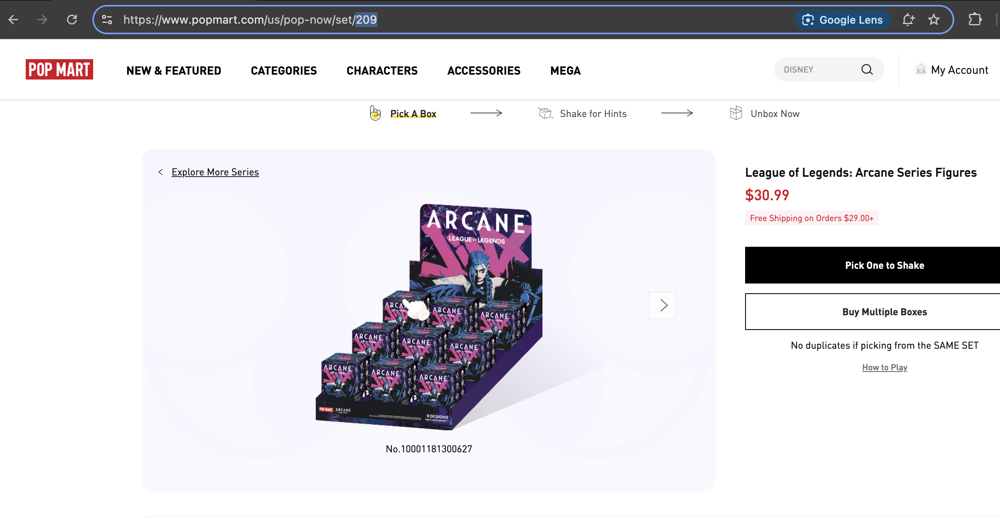
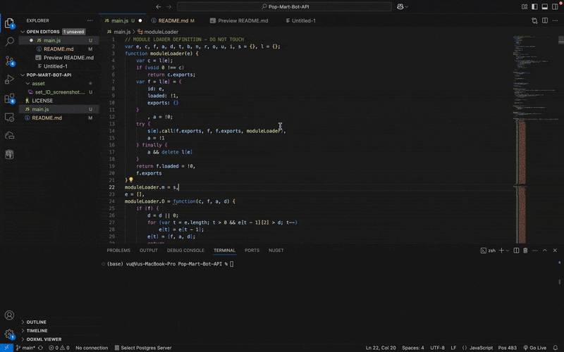

# Pop Mart Reservation Script

# 1. 🎁 Overview 
A simple script designed to automatically scrape and make reservations on Pop Mart products and blindboxes. Works faster than using Pop Mart's UI, which can help with securing high-demand drops

# 2. 📌 Features
- Automatically scrape for available blindboxes
- Instantly reserves blindboxes once detected
- Provides direct URL to reservation page for quick checkout
- Really simple to use

# 3. 🛠️ How to run
Copy the entire script into the Developer Tools Console on your browser (Ctrl + F12).  
__Note__: Remember to change the setId in the main.js file to the set you want. the setId can be found here on the URL of the box set page

# 4. 📸 Demo

# 5. 🚧 Future plans
- Build actual UI to be used with the script
- Utilize Tampermonkey for better code injection